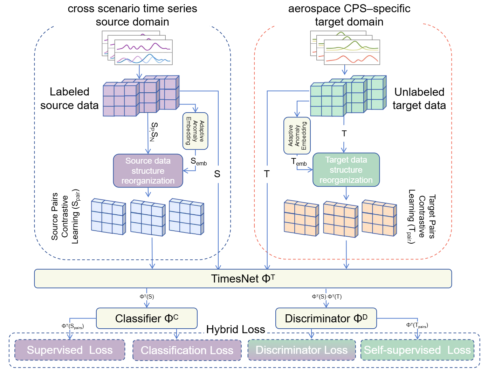

# ACRL
### Adaptive Contrastive Representation Learning for Anomaly Detection in  Aerospace  Cyber-Physical Systems


## Overview
<p align="justify">
Labeled anomaly data is rare in aerospace cyber-physical systems (CPS), posing severe challenges for reliable anomaly detection. Unsupervised domain adaptation (UDA) offers a potential solution by leveraging anomalies from a related source domain to detect anomalies in a target domain without abnormal labels. However, in aerospace CPS, it is often infeasible to find source-domain anomalies that match the target anomaly categories, severely limiting UDA’s transferability.
To address this limitation, we integrate contrastive learning with UDA and propose Adaptive Contrastive Representation Learning (ACRL) for aerospace CPS anomaly detection. ACRL incorporates an adaptive anomaly embedding mechanism, cross-domain supervised contrastive loss, and anomaly-entropy-centered classification to enhance generalization to unseen anomaly types and improve model robustness.
Comprehensive evaluations on multiple real-world aerospace CPS datasets demonstrate that ACRL achieves outstanding anomaly detection performance.
</p>

## Architecture
<div style="display:flex; justify-content:space-between;">
  
</div>

## Getting Started
#### Install dependencies (with python 3.10) 
```shell
conda create -n acrl python=3.10
conda activate acrl
# If using CPU
pip install torch==1.13.1 torchvision==0.14.1 torchaudio==0.13.1
# If using NVIDIA GPU (CUDA 11.7)
pip install torch==1.13.1+cu117 torchvision==0.14.1+cu117 torchaudio==0.13.1 --index-url https://download.pytorch.org/whl/cu117
pip install -r requirements.txt
```
## Usage
#### Run the MSL experiment
```shell
cd ACRL
python -m main.main_MBA_to_MSL
```
#### Run the SMAP experiment
```shell
cd ACRL
python -m main.main_MBA_to_SMAP
```
#### Run the PHM08  experiment
```shell
cd ACRL
python -m main.main_MBA_to_PHM08
```
#### Run the CATS experiment
```shell
cd ACRL
python -m main.main_MBA_to_CATS
```
#### Run the CMAPSS  experiment
```shell
cd ACRL
python -m main.main_MBA_to_CMAPSS
```

# Datasets

## 1. Aerospace CPS Datasets

### 1.1 MSL & SMAP
This dataset contains expert-labeled telemetry anomaly data from the **Soil Moisture Active Passive (SMAP)** satellite and the **Mars Science Laboratory (MSL)** rover *Curiosity*.  
[Download here](https://www.kaggle.com/datasets/patrickfleith/nasa-anomaly-detection-dataset-smap-msl)

---

### 1.2 PHM08 Data Challenge (Turbofan Engine)
- **Description**: PHM Society 2008 challenge dataset, essentially originated from the C‑MAPSS engine simulation. It is widely used for engine health monitoring and prognostics. Many research works use it for anomaly/fault detection or Remaining Useful Life (RUL) prediction.  
- **Tasks**:  
  - Anomaly detection (health/degradation transition)  
  - RUL prediction  
  - Health index construction  
- **Features**:  
  - Established community benchmark  
  - Rich comparative studies  
  - Easy reproducibility  
- **Source**: Archived in PHM Society challenge datasets or NASA PCoE repository.  
[Download here](https://data.nasa.gov/dataset/phm-2008-challenge)

---

### 1.3 NASA C-MAPSS  
(**Turbofan Engine Degradation Simulation, FD001–FD004**)  
A classic turbofan engine degradation simulation dataset that includes multiple sensor channels, various operating conditions, and degradation processes. Mainly used for RUL prediction, but can also be adapted for anomaly/fault detection (e.g., health-to-failure transition, threshold violation, change-point detection).  
[Download here](https://ti.arc.nasa.gov/tech/dash/groups/pcoe/prognostic-data-repository/)

---

### 1.4 CATS Dataset (Controlled Anomalies Time Series)  
Controlled anomaly time series dataset for simulating and evaluating anomaly detection algorithms in controlled settings.  
[Download here](https://www.kaggle.com/datasets/patrickfleith/controlled-anomalies-time-series-dataset)

---

## 2. Source Domain Dataset

### MIT-BIH Supraventricular Arrhythmia Database (MBA)
A collection of ECG recordings from **4 patients**, containing multiple instances of two types of supraventricular anomalies (supraventricular contraction or premature beat). This is a popular large-scale dataset in data management and biomedical signal processing research.  
[Download here](https://physionet.org/content/mitdb/1.0.0/)

## License
This project is under the Apache 2.0 license. See [LICENSE](./LICENSE.md) for details.


